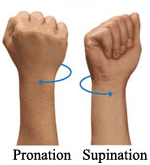

# Motorica internship task 2

**Ноутбук с чтением данных из формата palm находится в папке *sprint_2_xgb_RNN***

## Содержание

* [Summary](README.md#Summary)    
* [Data and methods](README.md#Data-and-methods)  
* [Results](README.md#Results)                              
* [Project structure](README.md#Project-structure)        

## Summary

## Data and methods
[Репозиторий задания](https://github.com/MaxBalashov/motorica-x-skillfactory-internship/tree/main/Sprint%202) и [описание задачи от Моторики](https://docs.google.com/document/d/19GRheCcc2RBV-TcyIPcbsEt9YQwhPwTsJFT2dJGmpY8/ )

**Задача**
 
Построение модели для непрерывного управления пальцами протеза. В данные этого спринта добавлен жест "Open", который представляет из себя полностью выпрямленную ладонь и пальцы. Его отличие от нейтрали состоит в том, что нейтраль - это расслабленная кисть руки.

  

Для информации: также изменилась конструкция (версия) манжеты, с помощью которой собирались данные.

## Results

## Project structure