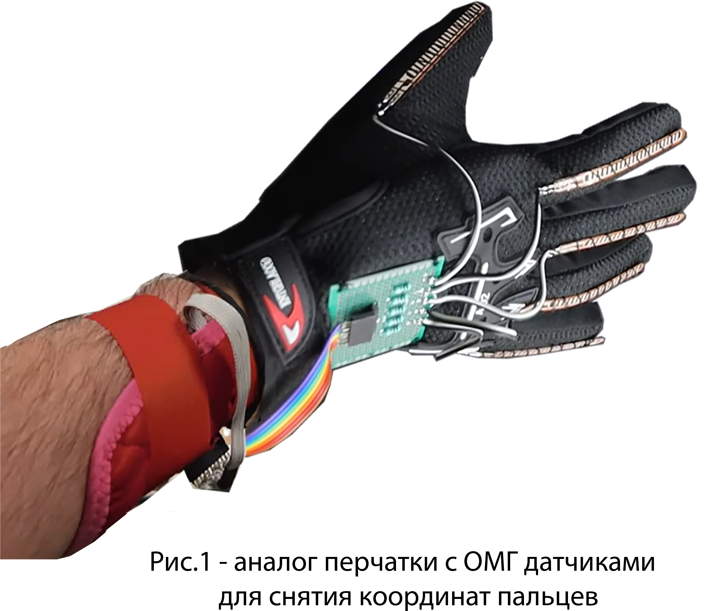

# Motorica task 3

## Содержание

* [Summary](README.md#Summary)    
* [Data and methods](README.md#Data-and-methods)  
* [Results](README.md#Results)                              
* [Project structure](README.md#Project-structure)        

## Summary
В ходе исследования создан алгоритм автоматизации протеза кисти на основе нейросети LSTM. Среднее время 1 вычисления составляет 7±1 мс, что в 5 раз меньше принятого ограничения в 33 мс на операцию. Избыточная подвижность протеза из-за ошибок предсказания модели успешно устраняется выходным фильтром. Алгоритм удовлетворительно адаптирутеся к произвольному монтажу датчиков

## Data and methods
Экспериментальные данные представлены в формате .palm. Для их преобразовывание в формат .csv и обработки средствами Pandas используется специальная функция. Исходными данными являются дискретные сигналы 50 оптомиографических датчиков (ОМГ), которые равномерно распределены во времени с шагом в 33 мс (1 тик или 1 период). Помимо сигналов ОМГ датчиков также записовались данные с акселерометров и гироскопов. Снятие показаний выполнялось непрерывно с помощью перчатки (рис.1), на которой установлены датчики (Glove). 

  

В процессе записи показаний оператор протеза последовательно повторял ряд жестов согласно выбранному протоколу. Оператор перчатки выполнял наиболее распространённые жесты: хват, открытая ладонь, "пистолет", сгиб большого пальца, и др.  Сигналы ОМГ и координаты пальцев представлены на рис.2.

  

Распознование экспериментальных данных каждого монтажа по отдельности затрудено по нескольким причинам: 
* характер сигналов изменяется во времени для одинаковых жестов
* при выполнении большинства жестов движение пальцев осуществляется совместно
* напряжение и расслабление мышц предплечья в процессе жеста может происходить неравномерно
* сложно установить ОМГ датчики на одинаковый участок кожи, чтобы получить "одинаковый монтаж", и т.д. 

После сбора экспериментальных данных происходило снятие перчатки. Затем сбор данных повторялся при новом монтаже перчатки. При этом характер и средние уровени показаний ОМГ датчиков изменялись (см. рис.3). Это обстоятельство ограничивает объединение сигналов разных монтажей без предобработки для тренировки модели.

  

**Задача**
 
Разработать алгоритм автоматизации бионического протеза кисти, предсказывающего координаты пальцев в диапазоне [0,100] по сигналам с оптомиографических датчиков. Время работы 1 цикла алгоритма должно составлять менее 33 мс.
Кроме того, требуется проверить возможность преобразования данных различных монтажей для увеличения универсальности алгоритма.
 

## Results

  

## Project structure