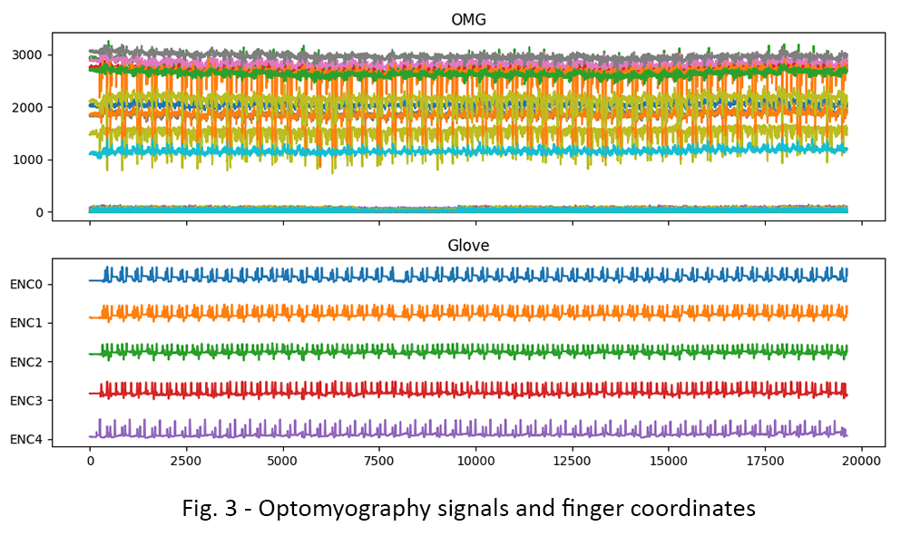
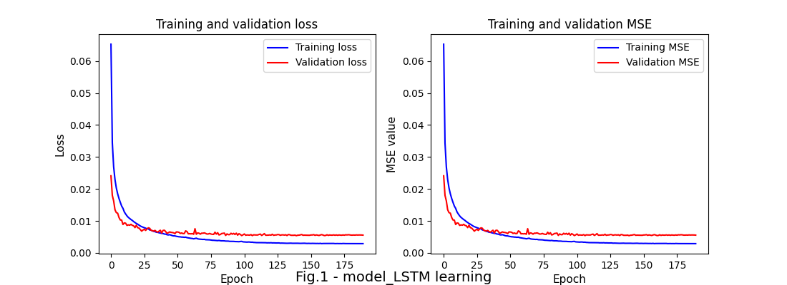

# Hand prosthesis automation


## Content

* [Summary](README.md#Summary)
* [Introduction](README.md#Introduction)
* [Data and methods](README.md#Data-and-methods)  
* [Results](README.md#Results)     
* [Проверка универсальности алгоритма](README.md#Проверка-универсальности-алгоритма)
* [Заключение](README.md#Заключение)                    
* [Структура проекта](README.md#Структура-проекта)        


## Summary

It was created a custom algorthm to manage a bionic hand prosthesis using muscle signals form optomyographic sensors. The mean execution time of the program is $7\pm1$ msec that is about five time less than an aveage human is needed to react. The core part of the algorithm is an LSTM neural network which satisfactory adopts to various hand gestures and initial position of sensors.

<p align="center">  </p>

## Introduction

A traumatic loss or damage of a person's hand significantly limits his work ability in modern society. Considerable rehabilitation of such patients can be done by bionic hand prostheses.

Automation of prosthetics is a labor-intensive engineering task. On the other hand, modern powerful and lightweight microcontrollers combined with artificial intelligence make it possible to create a more advanced prosthetic hand.

The project goal was to develop an autoamtion algorithm for a bionic hand prosthesis that predicts finger coordinates in the range from 0 to 100 based on signals from optomyographic sensors. The operating time of 1 cycle of the algorithm should be less than 33 ms. In addition, it is necessary to check the algorithm's adaptivity to various montages of the prosthesis.

## Data and methods

As input data, we used signals from forearm muscles which were aquired by a following standardized protocol: an experimenter (having two healthy hands) had been performed a repeating sequence of gestures. The movements set consists of the most frequently encountered finger gestures in everyday life: grip, open palm, “pistol”, bend of the thumb, etc. Muscle tension was recorded by 50 optomyographic (OMG) sensors with the frequency of 30.3 Hz. The total recorded time was slightly less than 30 minutes. Every 10 minutes the experimenter was changing the orientation of the inner palm side: 0 degrees (parallel to the ground), 90 degrees, and -90 degrees. The finger coordinates, their acceleration and the palm angle were measured by an additional set of sensors,accelerometers and hyroscopes respectively. All these detectors were attached to the special glove (Fig. 1).

<p align="center">  </p>

The experimental set of discrete signals was originally recorded in .palm format and converted into .csv format using Pandas and the MNE open library. A sample of muscle signal and fingrer coordinates is shown on the Fig.2.
 
<center>  </center>

During the signals analysis we faced with multiple challenges:
* the signals amplitude of the same gestures changes over time. This might be happened due to fatigue of the experimenter.
* fingers move together while performing most of gestures. This dynamics was caused by natural structure of human hands and inherited characteristics of ligaments.
* tension and relaxation of the forearm muscles during the gesture may occur unevenly in time. This may also be explained by natural structure of human hand.
* it is difficult to repeat a sensor installation when OMG sensors are placed on the same area of the forearm. The detection area is relatively small whereas the muscle surface is uneven. As a result, it is hard to find the same muscle area.

These circumstances limit consecutive combination of raw signals from different montages. Thus, we decided to modulate the frequency of the second montage before its join to the first montage (see Fig. 3).  

<p align="center">  </p>

## Results

Для предсказания координат пальцев разработан алгоритм из 4 логических блоков:
* Предобработка данных
* Модель машинного обучения
* Постобработка предсказания
* Формирование команд

Схема алгоритма представлена на рис.4.

<p align="center">  </p>

На стадии предобработки данные скалируются в диапазон [0,1]. Затем выбросы данных за пределами $\pm 1.5 \cdot IQR$ заменяются на граничные значения. После этого массив данных объединяется с массивом из нисходящих разностей между текущим значением сигнала и значением за 5-й прошедший период. 

Объединённый массив предобработанных данных сначала разбивается на отрезки по 40 периодов для исключения обучения модели под протокол, что подтверждается графиком обучения (см. рис.5). Затем из массива выделяются тренировочнаяи тестовая выборки. Для предсказания координат используется нейросетевая модель со слоем LSTM, учитывая нелинейный характер ОМГ сигналов. Коэффициенты обученной модели сохраняются.  

<p align="center">  </p>

Для ускоренного получения предсказания координат используется аналогичная нейросетевая модель, которая использует ранее сохранённые коэффиценты без дообучения на новых данных. Среднее время работы вычисления составляет $7 \pm 1 мс$ для тестовых данных.

<p align="center">  </p>

Предсказанные моделью координаты пальцев требуют преобразования, поскольку их значения сильно изменяются во времени из-за недостатка экспериментальных данных и высокой чувствительности модели. Для этого используется фильтр Хольта-Винтерса, который выполняет экспонентциальноге сглаживание координат по формуле:

$$s_{t}=s_{t-1} + \alpha \cdot(x_{t}-s_{t-1})$$ 

где: 
* $\alpha$ - коэффициент сглаживания в диапазоне $\alpha \in [0,1]$
* $s_{t}$ и $s_{t-1}$ - значение значение координаты за время $t$ и $t-1$ соответственно.

После экспонентциального фильтра применяется алгоритм фильтрации мелких движений, которые отсекает изменение координат пальцев менее 2 единиц. Это позволяет устранить избыточную подвижность пальцев протеза и сохраняет заряд аккумулятора.

<p align="center">  </p>

## Проверка универсальности алгоритма

Одной из задач исследования являлось получение универсального алгоритма, предсказывающего координаты пальцев на монтаже с относительно произвольным расположением ОМГ датчиков. На данных 1 монтажа был проверен следующий метод преобразования: 
* определены номера "активных" датчиков, средние уровни сигналов которых превышают 200 единиц. Для таких датчиков вычислены средние значения. 
* получено отношение средних значений сигналов для обоих монтажей
* данные 1 монтажа домножались на кооэффициент отношения средних значений сигналов активных датчиков.

Использованный метод преобразования частично повторяет последовательность движений для указательного и среднего пальцев (ENC2 и ENC3 соответственно), однако среднеквадратическая ошибка предсказания высокая.

<p align="center">  </p>


## Заключение
Cоздан алгоритм расчёта координат пальцев для протеза кисти на основе нейросети LSTM. Достоиснства программного решеня заключаются в малом времени вычисления, малой среднеквадратической ошиби предсказания модели. Предложенный алгоритм обладает удовлетворительной адаптивностью к произвольному монтажу датчиков.


## Структура проекта

<details>
  <summary>display project structure </summary>

```Python
├── .gitignore
├── config 
│   └── data_config.json            # configuration settings
├── data                            # data archive
│   ├── sprint3_pilote1_mount1_gestures.palm
│   └── sprint3_pilote1_mount2_gestures.palm
├── figures                         # project figures
│   ├── fig_1_Glove_art.PNG
│   ├── fig_2.png
│   ├── fig_3_montage.png
│   ├── fig_4_shceme.png
│   ├── fig_5.png
│   ├── fig_5_outliers.png
│   ├── fig_6.png
│   ├── fig_7.png
│   ├── fig_78.png
│   ├── fig_78.psd
│   ├── fig_8 commands.png
│   └── fig_9.png
├── model
│   └── best_model.hdf5         # models and weights
├── models
│   ├── MinMax_scaler.bin
│   └── model_LSTM.hdf5
├── notebooks                   # notebook
│   ├── Gestures_3.ipynb
│   ├── model
│   └── sprint3.ipynb
├── README.md
└── utils                       # functions and data
    ├── config_reader.py
    ├── figures.py
    ├── functions.py
    └── __pycache__
```
</details>