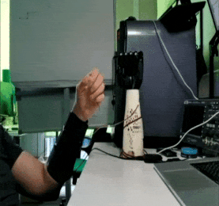
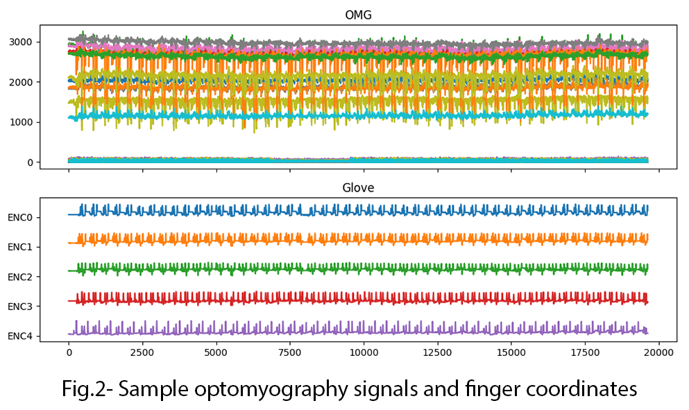

# Hand prosthesis automation


## Содержание

* [Введение](README.md#Введение)    
* [Данные и методы](README.md#Данные-и-методы)  
* [Результаты](README.md#Результаты)     
* [Проверка универсальности алгоритма](README.md#Проверка-универсальности-алгоритма)
* [Заключение](README.md#Заключение)                    
* [Структура проекта](README.md#Структура-проекта)        


## Summary
В ходе исследования создан алгоритм автоматизации протеза кисти на основе нейросети LSTM. Среднее время 1 вычисления составляет 7±1 мс, что в 5 раз меньше принятого ограничения в 33 мс на операцию. Избыточная подвижность протеза из-за ошибок предсказания модели успешно устраняется выходным фильтром. Алгоритм удовлетворительно адаптирутеся к произвольному монтажу датчиков.

<p align="center">  </p>


## Введение
Трудоспособнось человека в современном обществе существенно ограничивается после травматической потери или повреждения кисти. Для реабилитации таких пациентов могут применяться бионические протезы кисти.

Автоматизация протезов является трудоемкой инженерной задачей. Сдругой стороны, современные легкие и мощные микроконтроллеры в сочетании с искусственном интеллектом позволяют создать более совершенный протез кисти.

**Задача**

Разработать алгоритм автоматизации бионического протеза кисти, предсказывающего координаты пальцев в диапазоне [0,100] по сигналам с оптомиографических датчиков. Время работы 1 цикла алгоритма должно составлять менее 33 мс.
Кроме того, требуется проверить возможность преобразования данных различных монтажей для увеличения универсальности алгоритма.

## Данные и методы
Экспериментальные данные представлены в формате .palm. Для их преобразовывание в формат .csv и обработки средствами Pandas используется специальная функция. Исходными данными являются дискретные сигналы 50 оптомиографических датчиков (ОМГ), которые равномерно распределены во времени с шагом в 33 мс (1 тик или 1 период). Помимо сигналов ОМГ датчиков также записовались данные с акселерометров и гироскопов. Снятие показаний выполнялось непрерывно с помощью перчатки (рис.1), на которой установлены датчики (Glove). 

<p align="center">  </p>

Экспериментатор выполнял повторяющуюся последовательность жестов согласно выбранному протоколу, который содержит наиболее часто встречающихся в быту жестов: хват, открытая ладонь, "пистолет", сгиб большого пальца, и др.  Сигналы ОМГ и координаты пальцев представлены на рис.2.

<center>  </center>

Распознование экспериментальных данных каждого монтажа по отдельности затрудено по нескольким причинам: 
* характер сигналов изменяется во времени для одинаковых жестов
* при выполнении большинства жестов движение пальцев осуществляется совместно
* напряжение и расслабление мышц предплечья в процессе жеста может происходить неравномерно
* сложно установить ОМГ датчики на одинаковый участок кожи, чтобы получить "одинаковый монтаж", и т.д. 

После сбора экспериментальных данных происходило снятие перчатки. Затем сбор данных повторялся при новом монтаже перчатки. При этом характер и средние уровени показаний ОМГ датчиков изменялись (см. рис.3). Это обстоятельство ограничивает объединение сигналов разных монтажей без предобработки для тренировки модели. Поэтому было решено использовать данные 2 монтажа для обучения модели. 

<p align="center">  </p>

## Результаты

Для предсказания координат пальцев разработан алгоритм из 4 логических блоков:
* Предобработка данных
* Модель машинного обучения
* Постобработка предсказания
* Формирование команд

Схема алгоритма представлена на рис.4.

<p align="center">  </p>

На стадии предобработки данные скалируются в диапазон [0,1]. Затем выбросы данных за пределами $\pm 1.5 \cdot IQR$ заменяются на граничные значения. После этого массив данных объединяется с массивом из нисходящих разностей между текущим значением сигнала и значением за 5-й прошедший период. 

Объединённый массив предобработанных данных сначала разбивается на отрезки по 40 периодов для исключения обучения модели под протокол, что подтверждается графиком обучения (см. рис.5). Затем из массива выделяются тренировочнаяи тестовая выборки. Для предсказания координат используется нейросетевая модель со слоем LSTM, учитывая нелинейный характер ОМГ сигналов. Коэффициенты обученной модели сохраняются.  

<p align="center">  </p>

Для ускоренного получения предсказания координат используется аналогичная нейросетевая модель, которая использует ранее сохранённые коэффиценты без дообучения на новых данных. Среднее время работы вычисления составляет $7 \pm 1 мс$ для тестовых данных.

<p align="center">  </p>

Предсказанные моделью координаты пальцев требуют преобразования, поскольку их значения сильно изменяются во времени из-за недостатка экспериментальных данных и высокой чувствительности модели. Для этого используется фильтр Хольта-Винтерса, который выполняет экспонентциальноге сглаживание координат по формуле:

$$s_{t}=s_{t-1} + \alpha \cdot(x_{t}-s_{t-1})$$ 

где: 
* $\alpha$ - коэффициент сглаживания в диапазоне $\alpha \in [0,1]$
* $s_{t}$ и $s_{t-1}$ - значение значение координаты за время $t$ и $t-1$ соответственно.

После экспонентциального фильтра применяется алгоритм фильтрации мелких движений, которые отсекает изменение координат пальцев менее 2 единиц. Это позволяет устранить избыточную подвижность пальцев протеза и сохраняет заряд аккумулятора.

<p align="center">  </p>

## Проверка универсальности алгоритма

Одной из задач исследования являлось получение универсального алгоритма, предсказывающего координаты пальцев на монтаже с относительно произвольным расположением ОМГ датчиков. На данных 1 монтажа был проверен следующий метод преобразования: 
* определены номера "активных" датчиков, средние уровни сигналов которых превышают 200 единиц. Для таких датчиков вычислены средние значения. 
* получено отношение средних значений сигналов для обоих монтажей
* данные 1 монтажа домножались на кооэффициент отношения средних значений сигналов активных датчиков.

Использованный метод преобразования частично повторяет последовательность движений для указательного и среднего пальцев (ENC2 и ENC3 соответственно), однако среднеквадратическая ошибка предсказания высокая.

<p align="center">  </p>


## Заключение
Cоздан алгоритм расчёта координат пальцев для протеза кисти на основе нейросети LSTM. Достоиснства программного решеня заключаются в малом времени вычисления, малой среднеквадратической ошиби предсказания модели. Предложенный алгоритм обладает удовлетворительной адаптивностью к произвольному монтажу датчиков.


## Структура проекта

<details>
  <summary>display project structure </summary>

```Python
├── .gitignore
├── config 
│   └── data_config.json            # configuration settings
├── data                            # data archive
│   ├── sprint3_pilote1_mount1_gestures.palm
│   └── sprint3_pilote1_mount2_gestures.palm
├── figures                         # project figures
│   ├── fig_1_Glove_art.PNG
│   ├── fig_2.png
│   ├── fig_3_montage.png
│   ├── fig_4_shceme.png
│   ├── fig_5.png
│   ├── fig_5_outliers.png
│   ├── fig_6.png
│   ├── fig_7.png
│   ├── fig_78.png
│   ├── fig_78.psd
│   ├── fig_8 commands.png
│   └── fig_9.png
├── model
│   └── best_model.hdf5         # models and weights
├── models
│   ├── MinMax_scaler.bin
│   └── model_LSTM.hdf5
├── notebooks                   # notebook
│   ├── Gestures_3.ipynb
│   ├── model
│   └── sprint3.ipynb
├── README.md
└── utils                       # functions and data
    ├── config_reader.py
    ├── figures.py
    ├── functions.py
    └── __pycache__
```
</details>